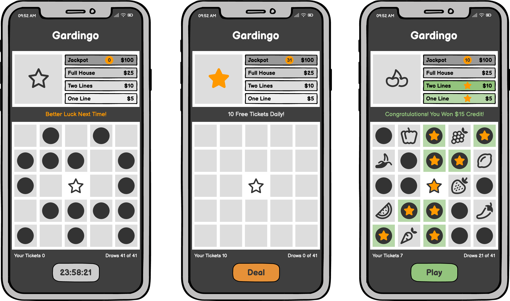
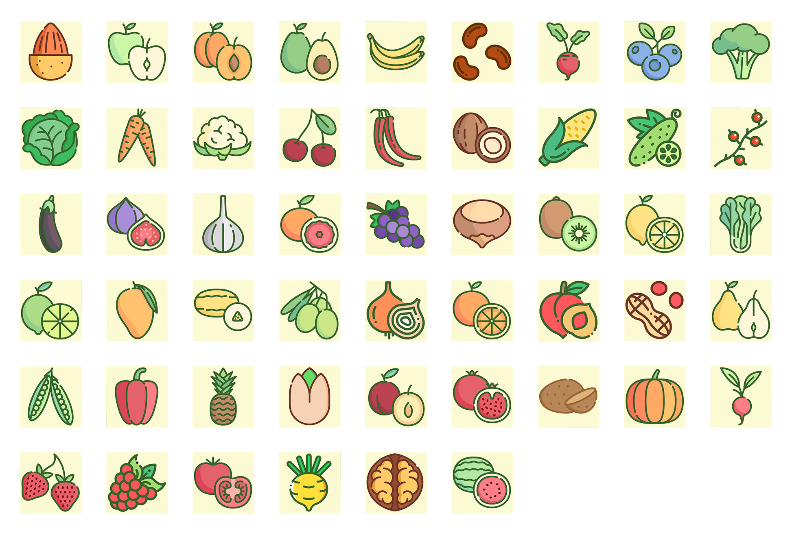

# Gardingo

Bingo game featuring Fruits, Vegetables, Berries, and Nuts.

Receive 10 free tickets daily, with a chance to win a $100 credits jackpot!

Please read the [Project Brief](concept/Project_Brief.md) document to learn more about the client and project requirements.

[Live Preview](https://x) (Coming soon...)

#### Table of Contents

...

## Strategy

Provide users with a fun and interactive experience to win promotional credits.

#### Users

*Customer*

- Universal customer base

*Admin*

- Marketing, promotional, and sales teams

#### User Needs

*Customer*

* Have fun playing Bingo anywhere
* Win credits

*Admin*

* Generate leads
* Increase user engagement
* Promote the brand
* Collect user emails

#### Business Goals

* User sign ups
* Product promotion

## Scope

Provide users with a daily free-to-play Bingo game, offering a chance to win credits while capturing leads.

#### Features

* Interactive animations
* Engaging experience
* Mobile optimised

#### User Stories

...

#### Designs

51 unique garden items.

#### Fonts

...

#### Brand Colours

## Tech

- [Pixi.JS](https://pixijs.com/) - Pixi.JS
- [Sass](https://sass-lang.com/) - Sass
- [Webpack](https://webpack.js.org/) - Webpack

## Tools

- [Balsamiq Cloud](https://balsamiq.cloud/) - Wireframes
- [Cloudflare](https://www.cloudflare.com/) - Hosting
- [Coolors](https://coolors.co/) - Colours

## Credits

- [English For Kidz](https://www.englishforkidz.com/2019/04/fruits-vegetables-bingo-game.html) - Images of Fruits, Vegetables, Berries, and Nuts.